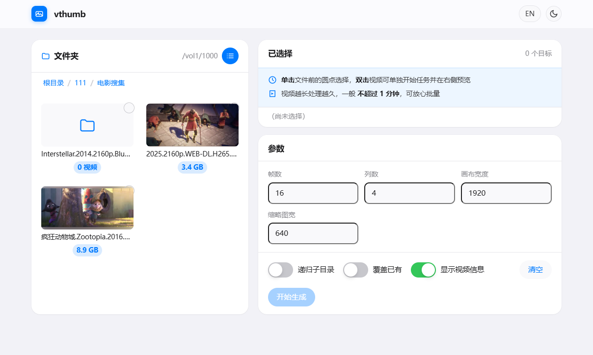

# vthumb

> [English](README.md) | [中文文档](README_zh.md)

PotPlayer 风格视频缩略图生成器 · WebUI + CLI

生成干净的 N×N 视频帧网格缩略图，附视频元信息和时间戳
——类似 PotPlayer 内置的"创建缩略图"功能，以自托管 Web 服务形式运行。

## 截图预览

| | |
|---|---|
|  |  |
| **WebUI 主界面**：左侧文件浏览器 + 右侧参数面板 | **预览面板**：视频元信息 + 4×4 帧网格 + 时间戳 |

**实际生成的缩略图样图**（1920px 宽画布，疯狂动物城 BluRay，4 列 × 4 行 = 16 帧，顶部带信息栏）：


## 生成效果

- 顶部信息栏：文件名 / 大小 / 分辨率 / 编码 / 时长
- N 列等距采样帧网格，每帧 letterbox 到 16:9（竖屏自动 9:16）
- 时间戳居中于每帧底部
- 白底画布 + 1px 灰色边框 + 白色间距
- 输出 `<视频文件名>.jpg`，默认画布宽度 1920px

## 快速开始

### 原生运行（推荐）

```bash
sudo apt-get install -y --no-install-recommends \
    ffmpeg fonts-noto-cjk fonts-noto-cjk-extra
sudo python3 -m pip install --break-system-packages \
    aiohttp==3.9.5 "Pillow>=10.0.0"

BROWSE_ROOT=/path/to/your/media PORT=8800 python3 server.py
```

浏览器打开 `http://localhost:8800`。

### Docker

```bash
# 编辑 docker-compose.yml 设置媒体库挂载路径，然后：
docker compose up -d --build
```

### CLI 命令行

```bash
python3 server.py /path/to/videos --cols 5 --count 25 --width 2560 --lang zh
```

## WebUI 用法

1. **左侧**浏览媒体库。
2. **点击圆点**勾选要生成缩略图的视频。
3. **双击视频**单独生成完整缩略图并在右侧预览。
4. 点 **开始生成** 批量处理所有选中的视频，进度通过 WebSocket 实时推送。

## 配置参数

| 环境变量 | 默认值 | 说明 |
|---------|--------|------|
| `PORT` | 8800 | HTTP 监听端口 |
| `BROWSE_ROOT` | /mnt/media | 文件浏览根路径 |
| `MEDIA_ROOT` | /mnt/media | HTTP API 访问根路径 |
| `DEFAULT_COUNT` | 16 | 每张缩略图帧数 |
| `DEFAULT_COLS` | 4 | 网格列数 |
| `DEFAULT_WIDTH` | 1920 | 画布总宽度 (px) |
| `DEFAULT_LABEL_LANG` | en | 信息栏标签语言 (en / zh) |
| `JPEG_QUALITY` | 95 | 输出 JPEG 质量 (1–100) |
| `SPRITE_CACHE_DIR` | ./cache/sprite | 单帧缩略图缓存目录（自动失效） |

## HTTP API

| 端点 | 方法 | 说明 |
|------|------|------|
| `/` | GET | WebUI 页面 |
| `/api/browse?path=...` | GET | 浏览目录 |
| `/api/generate` | POST | 生成缩略图（同步或异步 WS 进度） |
| `/api/preview?v=...` | GET | 单视频完整缩略图 JPEG 流 |
| `/api/sprite?v=...&w=...` | GET | 单帧小图（自动磁盘缓存） |
| `/ws/progress` | WS | 批量任务实时进度 |

生成请求示例：

```json
{
  "paths": ["Movies"],
  "recursive": false,
  "force": true,
  "count": 16,
  "cols": 4,
  "width": 1920,
  "lang": "zh"
}
```

## 依赖

- Python 3.11+
- ffmpeg / ffprobe（需在 PATH 中）
- Pillow ≥ 10.0
- aiohttp 3.9
- 可选：CJK 字体 (`fonts-noto-cjk`) 用于中文 / 日文 / 韩文文件名显示

## 故障排查

### 中文字符显示为方框 □

安装 CJK 字体：

```bash
sudo apt-get install -y fonts-noto-cjk fonts-noto-cjk-extra
sudo fc-cache -f
```

### 服务无法访问

```bash
# 原生：journalctl
journalctl -u vthumb.service -n 50

# Docker
docker compose logs -f vthumb
```

## License

MIT

## 与 Windows PowerShell 版本的区别

| | Windows vthumb.ps1 | vthumb |
|---|---|---|
| 语言 | PowerShell + .NET | Python + Pillow + ffmpeg |
| 字体 | Microsoft YaHei UI | DejaVu Sans / Noto CJK |
| 输出 | PNG | JPEG (quality 95) |
| 时间戳 | 右下角 | 底部居中 |
| 交互 | CLI 批处理 | WebUI + CLI |
| Letterbox | ffmpeg pad 滤镜 | Pillow 合成 |